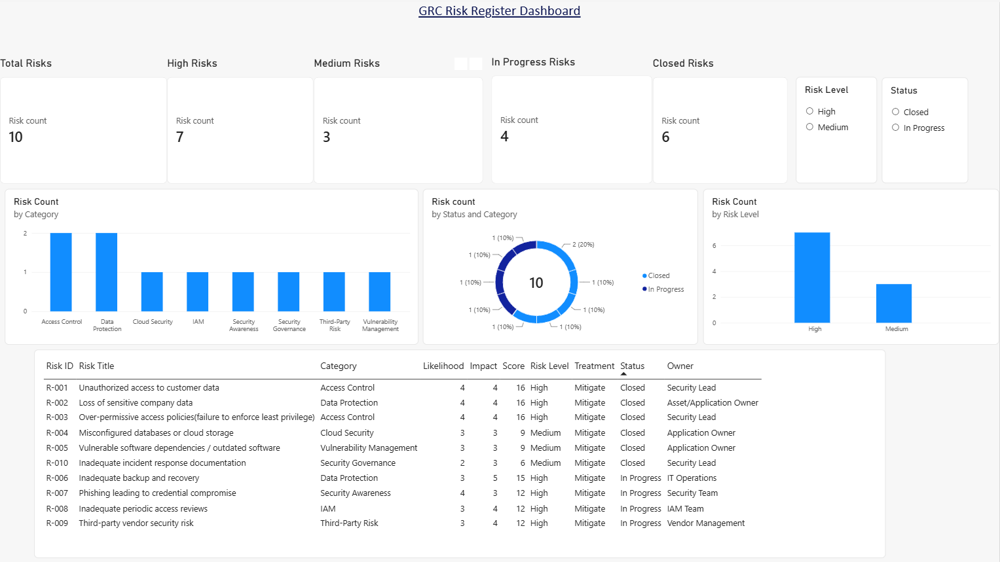

# GRC Risk Register & Power BI Dashboard

## Project Overview

This project demonstrates a practical approach to documenting, assessing, and monitoring cybersecurity risks using a risk register & Power BI dashboard.

The project is based on a fictional B2B SaaS organization and uses sample security risks across areas such as access control,
data protection, cloud security, IAM, vulnerability management, and third-party risk.

## Objective

The objective was to:

* Create and maintain a structured cybersecurity risk register
* Assess risks using Likelihood × Impact
* Assign risk levels and treatment status
* Identify high-priority risks
* Visualize risk information through a Power BI dashboard
* Provide a simple management view of risk status and risk categories

## Risk Assessment Methodology

A simple 1–5 scoring scale was used for both Likelihood and Impact.

**Risk Score = Likelihood × Impact**

Risk levels were categorized based on the calculated risk score.

The risk register includes:

* Risk ID
* Risk Title
* Risk Category
* Likelihood
* Impact
* Risk Score
* Risk Level
* Risk Treatment
* Status
* Risk Owner

## Power BI Dashboard

The dashboard provides visibility into:

* Total number of risks
* High and Medium risks
* Open/In Progress and Closed risks
* Risk distribution by category
* Risk treatment status
* Risk severity distribution
* Detailed risk register
* Interactive filtering by Risk Level and Status

## Tools & Technologies

* Microsoft Power BI
* Microsoft Excel
* GitHub

## GRC Concepts Demonstrated

* Risk Identification
* Risk Assessment
* Risk Scoring
* Risk Treatment
* Risk Ownership
* Risk Monitoring
* Security Controls
* ISO 27001-aligned Risk Management
* Management Reporting

## Project Context

This is a **mock/practical learning project** created to strengthen hands-on understanding of cybersecurity GRC, risk management & security reporting.

The project does not represent work performed for an actual organization and uses fictional/sample data.

## Skills Demonstrated

* Cybersecurity Risk Assessment
* Risk Register Development
* Risk Prioritization
* Risk Monitoring
* Power BI Dashboard Development
* Security Data Visualization
* GRC Documentation
* Management Reporting

